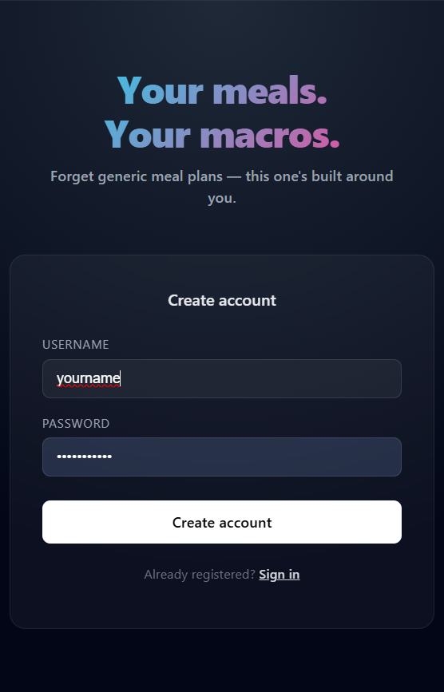
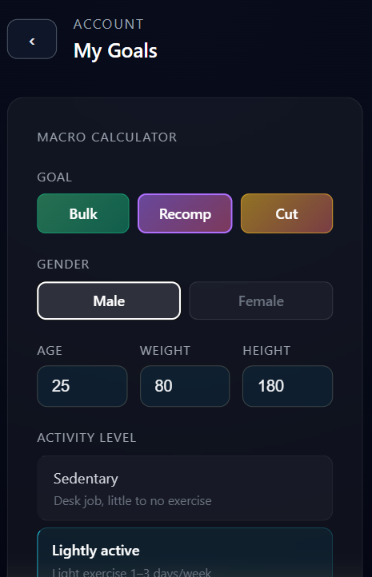
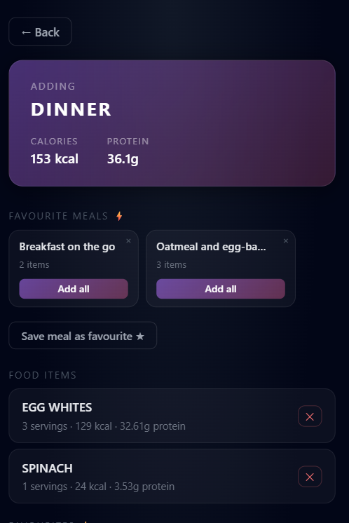
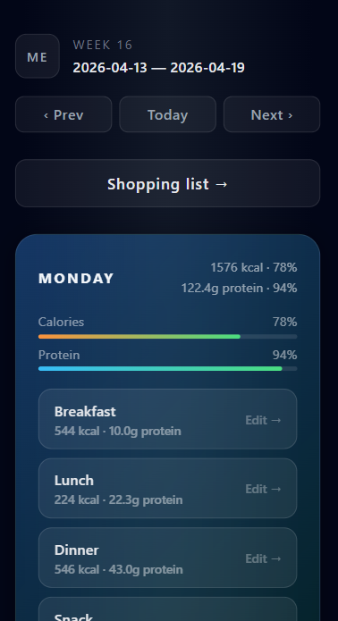
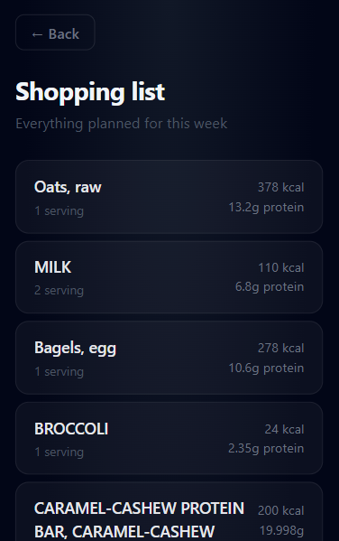

# Macro Meal Planner Frontend

React frontend for a macro-focused weekly meal planner. Plan meals around personal goals and track calories and protein per meal, day, and week.

## Screenshots

| Login | Goals | Add meal items |
|---|---|---|
|  |  |  |

| Weekly planner | Shopping list |
|---|---|
|  |  |

## Built with
- React 19
- Vite
- React Router
- Axios
- JWT authentication

## Development Notes
- Frontend developed in parallel with backend architecture
- Certain features and finalized styling implemented using AI-assisted development
- Focus on maintaining consistency with backend API and existing UI patterns

## Features
- Weekly meal planner with day-by-day breakdown
- Meal slots per day (breakfast, lunch, dinner, snacks)
- Food search via USDA FoodData Central
- Manual food entry
- Daily macro progress bars (calories + protein)
- Favourite food items with one-click quick-add
- Favourite meal templates with one-click quick-add
- Weekly shopping list with aggregated ingredients
- Macro calculator (BMR/TDEE) with body stats
- User goal setting (calories + protein targets)
- Mobile responsive

## Pages
- `/auth` - Login and registration
- `/planner` - Weekly meal planner
- `/MealCreator` - Add and manage food items for a meal
- `/user` - Goals, body stats and macro calculator
- `/list` - Weekly shopping list

## Quick start

### Requirements
- Node.js 18+

### Install dependencies
```bash
npm install
```

### Environment
Create a `.env` file:
